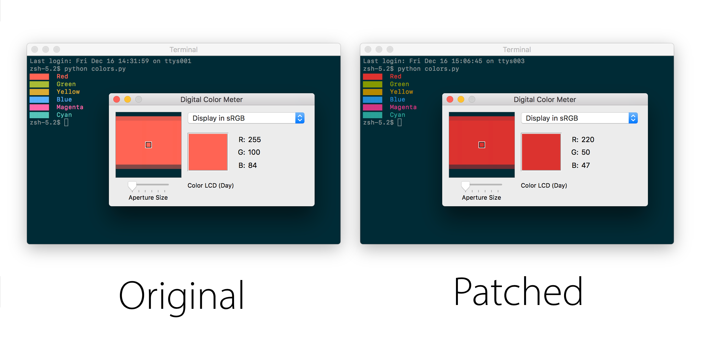

Terminal.app Color Adjustment Patch
===================================

Instructions
------------
It is recommended to run the patch on a copy of Terminal.app rather than the original. The script below patches a copy of the application.

    cp -XR /Applications/Utilities/Terminal.app Terminal.app
    python patch.py Terminal.app

To modify the original system copy, System Integrity Protection first needs to be disabled.

To check that the patch is working, run the included `colors.py` Python script and measure the output color with the Digital Color Meter.

Background
----------
Patch for macOS Terminal.app to disable color adjustments.

Although Terminal.app supports custom colors, foreground (text) colors are adjusted based off of the background to offer better contrast. This results in the colors looking washed out and makes it difficult to accurately reproduce color schemes such as the popular Solarized theme within the terminal.

There isn't an official method of disabling this adjustment, and [previous workarounds](http://apple.stackexchange.com/questions/29487/is-it-possible-to-disable-terminals-automatic-tweaking-of-colors-in-lion) no longer function. This patch makes it possible to have precise color output without resorting to a third-party terminal app.

Details
-------
The adjusted color is calculated within the `-[TTView adjustedColorWithRed:green:blue:alpha:withBackgroundColor:force:]:` method. This patch alters the method to return the original color instead.

License
-------
This project is available under the Apache 2.0 license. See LICENSE for details.
